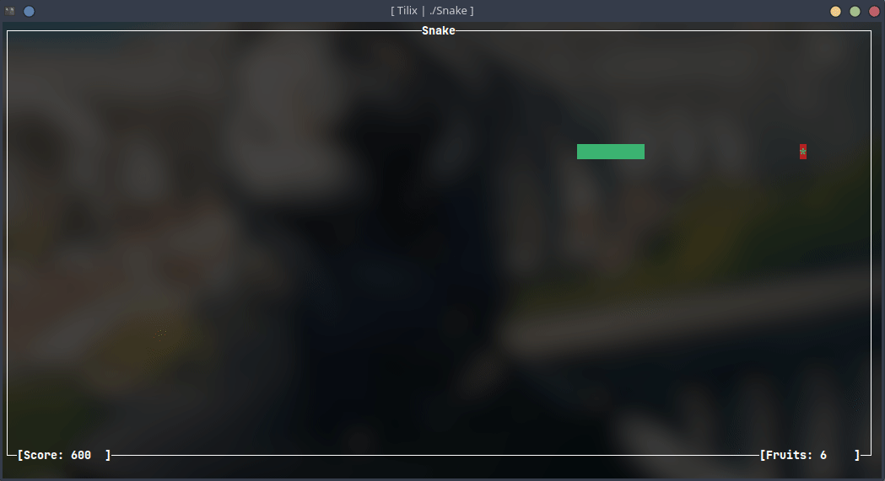

# Snake

Snake game written in C using ncurses.

## Compilation

On Linux

    clang -lncurses main.c -o Snake

On Windows

    gcc main.c -lpdcurses -o Snake.exe

To install pdcurses on Windows, download MinGW, and pdcurses from <a href="https://sourceforge.net/projects/pdcurses/files/pdcurses/3.4/pdc34dllw.zip/download">here</a> and follow <a href="https://cects.com/adding-pdcurses-to-mingw/">this steps</a>.

## Preview

## Debug

To show more information like the board size, the fruit coordinates and the snake coordinates, you can use the debug option.

    clang -lncurses -DDEBUG main.c -o Snake

## To do

Add a game menu and scores
